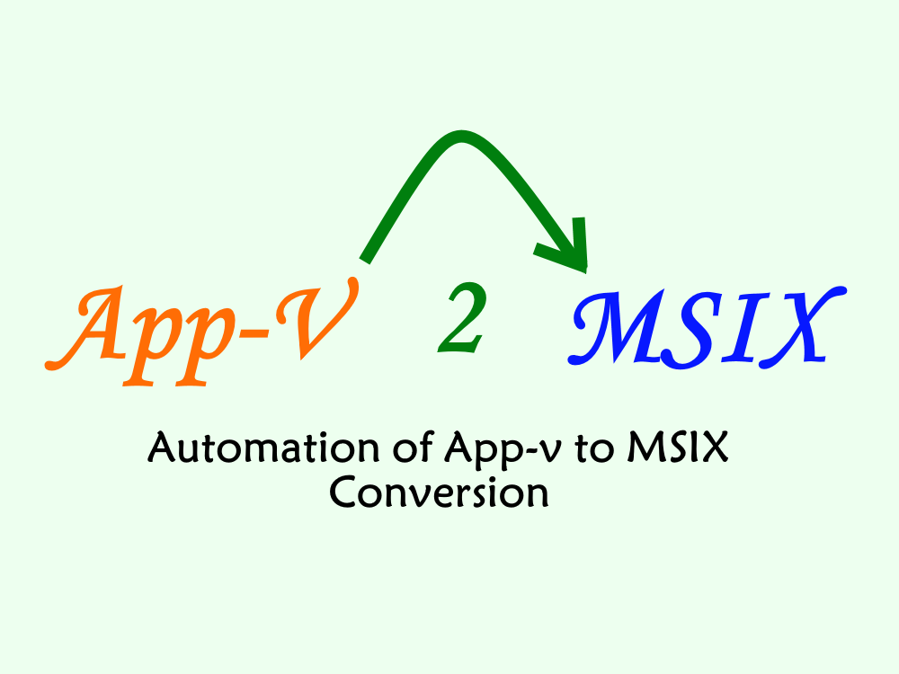

# AppV2MSIX
A community tool to aid in the automatic conversion of Microsoft App-V packages into the modern MSIX package format.

## Background
Microsoft App-V 5.x (and it's predecessors) has been the packaging format of choice for preparing and delivering software applications to Microsoft desktops and servers in large commercial organizations for the last 20+ years.

Microsoft developed new generation technology, MSIX, with the hopes of replacing the need for App-V.

It is known that MSIX does not handle all of the applications that App-V handled well, but after a number of years of work we can confidently say that we can handle most of them when the Package Support Framework and other tricks are used.

Companies contemplating a move from App-V to MSIX may want to consider if a conversion of their existing App-V packages is an option, or if new MSIX packages created from scratch is a better way to go.

While the highest rate of success will be to package from scratch, we can get a reasonable percentage of your packages working with an automated conversion. It will be less successful than if you package from scratch, but with the automation available in these scripts, most of the work is in testing the converted packages.  Those that don't work you will then need to repackage, either in MSIX or another means.

There are a couple of categories of packages that will require a manual effort.  
* App-V packages that use scripts if the first.  
* Packages with shortcuts to non-exe files (like documents or websites) are the second.  

What percentage of your packages will convert into successful packages may depend on your packages and your applications.  But to put some numbers out there, if 80% of your applications would be acceptable if repackaged into MSIX then maybe 60% will be acceptable from converting the App-V packages using this script.

## How this works
The script is first edited by you to supply folder locations and information on your digital signature if needed.  There is a convenient spot at the top of the `AppV2MSIX.ps1` file where you make all changes.

The script runs on any real or virtual machine that has the following installed:
* `PassiveInstall` (Required): A free powershell module that you can download from TMurgent.com.
* `Microsoft MSIX Packaging Tool` (Required): A free app in the Microsoft Store.
* `signtool.exe` (Optional) This is available from the Microsoft SDK, for example.  It is needed only if you don't use TMEditX and want to sign the MSIX packages created by the MSIX packing tool.
* `TMEditX` (Optional): A licensed app that you can get from TMurgent.com. This is highly recommended as it is the only way to get the Package Support Framework into the package; without it that 60% becomes maybe 30%.

The VM used does not need a clean snapshot/checkpoint or reverting.  The initial conversion, accomplished by the Microsoft MSIX Packaging Tool is a straight conversion and not a monitored installation.  TMEditX acts more as an automated editor to fix up the package after creation by the Microsoft tool.

You will place the files from this repository on a folder on the machine used for the conversion, edit the script (described below) and just run the powershell file.  It requires elevation (for the code signing), but it will prompt you for it if you forget.  You run the script once and it converts all packages.

## Editing
When editing the AppV2MSIX file with file locations, you may use either local folders or folders on network shares.  The key things to be edited fall in two categories.

### Editing Basic Configurations:
* `$AppvContentStore` - Folder containing the App-V packages to be processed. You probably should create a folder with a filtered copy of the packages on your production share.  Filter out unused packages or things you know just don't make sense.
* `$ConversionOutputFolder` - Top-level folder to contain the outputs.  Two or three subfolders will be created under it, one for logs, one for converted packages, and one for fixed packages.  This is often on the local VM to speed up the processing.
* `$PublisherName`, `$PublisherDisplayName` - These fields are needed to go into the AppXManifest file of the MSIX package.  The publisher name is in 'CN=...' format to match your code signing certificate subject field.
* `$Certificate`, `$CertificatePassword`, `$TimestampingURL`, `$SignToolPath` - Although the MSIX Packaging Tool may be configured for package signing, it doesn't sign converted packages.  If you are using TMEditX, it will perform the signing for you and you can disable the signing of unfixed packages (see `$SkipAllSigning` below) and you do not need to edit these fields.

### Editing Control and Temporary Settings:
* `$SkipAllConversions`, `$SkipConversionsUntil`, `$ProcessOnlyPackage` - The default value of $False on the first entry causes all App-V packages found to be processed, which is what you probably want to do.  If something goes wrong you can start over by skipping a number of packages already converted, or give the name of a specific package to be converted.
* `$SkipAllSigning` - Set to true to skip signing the packages created by the packaging tool.
* `$SkipAllFixing` - Set to true if you are not using TMEditX to fix up the packages.
* `$MsixFixupParameters` - TMEditX will analyze the MSIX package as created by the MSIX packaging tool and fix it up automatically. TMEditX will be passed these parameters when run against each converted package.  These defaults are pretty darned good for most packages, but you can look at the TMEditX documentation for other possible settings.

## Running the script
If you start the script by starting an elevated PowerShell window (regular or ISE) and then run the script, you will be able to view the progress in the output.

Depending on configuration the script will:
* Convert each package using the Microsoft MSIX Packaging Tool. The MSIX Package names will be the same as the App-V package names, with underscores replaced by the minus character.  The version field of the packages created by the MSIX packaging tool will match that of the App-V packages.  
* After all conversions, sign each converted package, if requested.
* After this, run TMEditX to autofix each package, if requested.  The TMEditX tool, by default, will increment the version by one (either the third or fourth octet as configured), or it may be configured to not increment the version when fixing. TMEditX will sign the fixed-up packages with the code signing certificate in it's configuration, including fixing up the Publisher Name field of the AppXManifest if necessary. 

## Looking at the results
For each package, there will be a log file generated by the Microsoft MSIX Packaging Tool.  You should review these files, especially for errors, but also warnings about detected package scripts.  Other warnings in those files may or may not be important.

If TMEditX is used, there will two folders of packages, one is the output from the Microsoft Tool, the other is the packages output by TMEditX.  

There will be some package drop-outs, so compare lists.  Both the MSIX Packaging Tool and TMEditX may (rarely) have trouble and fail to produce a file at all.

## Testing the packages
Each package should receive a UAT style test.  This generally consists of the following:
* Check for missing shortcuts
* Launch app, look for error dialogs
* Check for possibly missing pre-configurations (is the autoupdate disabled, license keys or back end databases configured, etc).
* Change configuration, shut down app and reopen to confirm that user changes are "sticky".
* Launch app using any FTA or Shell Extension typically used as an alternative to the start menu shortcut.
* Test app functionality.
  
## Acknowledgements
The batch_convert.ps1 file is highly modified from the MSIX Toolkit, another open source project.
